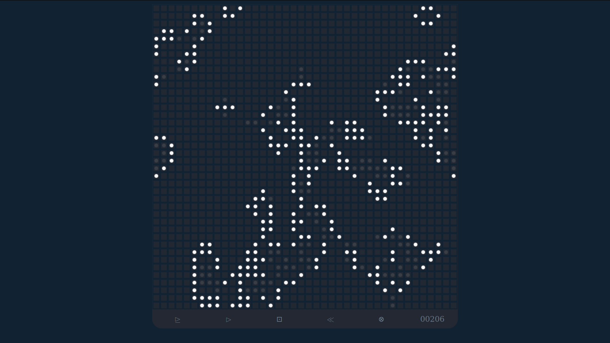

# game_of_life

**[▶ Run it](https://boris-volkov.github.io/game_of_life/)**

This is an interface into John Conway's "Game of Life". This is probably the most famous of the cellular automatons - basicly games that can be played on a sheet of graph paper, marking certain squares as "on" and others as "off", and the game progressing in steps based on the current position of the board.

This particular game progresses by the following rules:
    Any live cell with fewer than two live neighbours dies, as if by underpopulation.
    Any live cell with two or three live neighbours lives on to the next generation.
    Any live cell with more than three live neighbours dies, as if by overpopulation.
    Any dead cell with exactly three live neighbours becomes a live cell, as if by reproduction.
Or, equivalently:
    Any live cell with two or three live neighbours survives.
    Any dead cell with three live neighbours becomes a live cell.
    All other live cells die in the next generation. Similarly, all other dead cells stay dead.

You can play this game yourself on graph paper, but you will find it's rather hard to keep track of what's happening, especially because the entire grid needs to change "at once" each generation, and not square by square. It's much more fun to let a computer, which can do millions of calculations pre seoond, to do the counting for us. Then we can really see the grid come to life.

There is no real goal to the game, other than to search out starting positions that have interesting lives. 
this combination, for example:

		░░░░░░░░░
		░░●░░░░░░
		░░●░●●●░░
		░░●░░░░░░
		░░░░░░░░░

evolves in a very interesting way. It is in the "stamp" menu as *class demo* if you want to drop it straight onto the board.

Can you find any other interesting patterns? **Click a cell to turn it on or off, or drag to draw a whole line of them.** The `gen` counter tells you how many generations have passed, and `pop` how many cells are currently alive. `step` advances one generation, `play` runs it as an animation, `reset` returns you to your last setup, and `clear` empties the board. You can always just refresh the page to start over.

The **stamp** menu holds a handful of the classic patterns — a glider, a lightweight spaceship, a pulsar, the R-pentomino, an acorn, a diehard, and Gosper's glider gun, which is the one that manufactures gliders forever. Pick one and it follows your cursor as a faint outline; click to place it. Choose *draw cells* (or press escape) to go back to drawing by hand.

Keyboard controls:

		[space]  play / pause
		[n]      next generation
		[p]      play
		[s]      stop
		[x]      clear
		[r]      reset to last setup
		[?]      randomize
		[+] [-]  faster / slower
		[.] [,]  zoom in / out
		[]] [[]  longer / shorter trails
		[t]      trails on / off
		[w]      wrap edges on / off
		[g]      dots on crossings on / off
		[esc]    put the stamp away

The **rule** box is worth playing with too. Conway's rules written out in the standard notation are `B3/S23` — a dead cell is *born* with exactly 3 live neighbours, and a live cell *survives* on 2 or 3. Every other cellular automaton of this family is just a different pair of digit lists, so you can type them straight in. Try `B36/S23` ("HighLife", which has a tiny self-replicating pattern), or `B35678/S5678` ("Day & Night"), or make one up. Most rules you invent at random either die out immediately or fill the whole board — the interesting ones sit right on the boundary between those two fates, which is part of what makes Conway's choice a good one.

Oh, and one more important detail: I've altered the game a little here. The trouble is in how to deal with the edges of the board. There are several ways to answer this question: you can treat it as if your board is just a section of an infinite board stretching out in all directions, so if you send out a glider, it will just go on out of the edge and on to infinity. Another way is to treat the squares outside of the board as if they do not exist at all, as if there is a wall around the boundary of the grid. In this universe, a glider will hit the wall and turn into a 2x2 square. There is another way, which is to topologically identify the grid as a torus, by linking the right edge to the left edge, and the top edge to the bottom edge. In this world, a spaceship the leaves the left edge, will fly in seamlessly from the left edge. (like the old asteroids game) This is the default here, and I've found that there is more opportunity for life in this kind of universe. The **wrap edges** checkbox switches between the two: leave it on for the torus, turn it off and the board gets hard walls, so a glider that hits one collapses into a 2x2 block. Watching the same starting position play out under both is a nice way to see that the rules alone don't determine the game — the shape of the space matters too.

Neither of these is quite the "classic game of life" though, which lives on an infinite plane, and in which you can do crazy things like set up Turing Machines that operate digital clocks and even the game of life itself. Getting there from here means letting the grid grow itself wherever the action is, instead of living inside a fixed rectangle. That is still a good project if you want one.

### Sizing the board

The board opens at a fixed 19x19 — a go board's line count, and a nice size to start exploring on. Type different numbers into the **rows** and **cols** boxes for any other fixed size. Or tick **fit window**, and the board switches to filling the screen instead: the **zoom** slider sets how big a cell is, and the row and column count follows from however many fit in the space, so it always fills the screen and never spills off the bottom.

### Palettes, and stones on a go board

The **palette** menu reskins the whole board, not just the cells: *go board* for black stones on a wooden goban, *chalkboard* for chalk-white cells on green, *paper* for black ink on white (good for a projector in a bright room), and *amber* for an old phosphor terminal. It's all driven by a handful of CSS variables in [style.css](style.css), so adding another palette is a matter of picking colours, not touching the code.

The **on crossings** checkbox moves the *grid lines*, not the dots: each cell's dot always sits dead centre of its square, and normally the lines run around that, marking the square's edges. Tick the box and the lines instead run through the dots, meeting each one where the lines cross. Combine it with the *go board* palette and the default 19x19 size, and you've got a passable imitation of stones sitting on the intersections of a goban.

The settings also live in the address bar, so any board you set up is a link you can hand out:

	https://boris-volkov.github.io/game_of_life/?rows=100&cols=200
	https://boris-volkov.github.io/game_of_life/?fit=1&cell=6&rule=B36/S23&trail=80
	https://boris-volkov.github.io/game_of_life/?theme=go&dots=cross

Recognised parameters are `rows` and `cols` (a fixed board, 19x19 if neither is given), `fit=1` (fit the window instead) with `cell` (cell size in pixels), `rule`, `wrap=0`, `dots=cross`, `trail`, `speed`, and `theme` (`go`, `chalk`, `paper`, or `amber`). Changing anything in the page updates the URL to match, so you can also just get things looking how you want and then copy the address.

Okay, that's all you need to know. Now have fun with it. As always, the code is below, and you should take a look under the hood to see how all this works.
